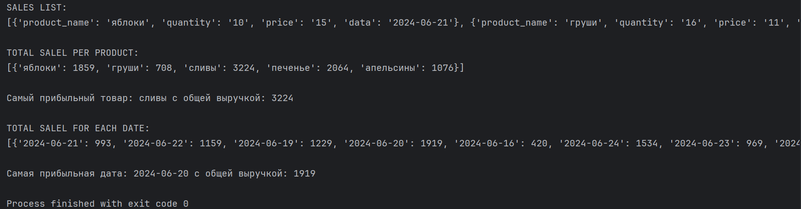
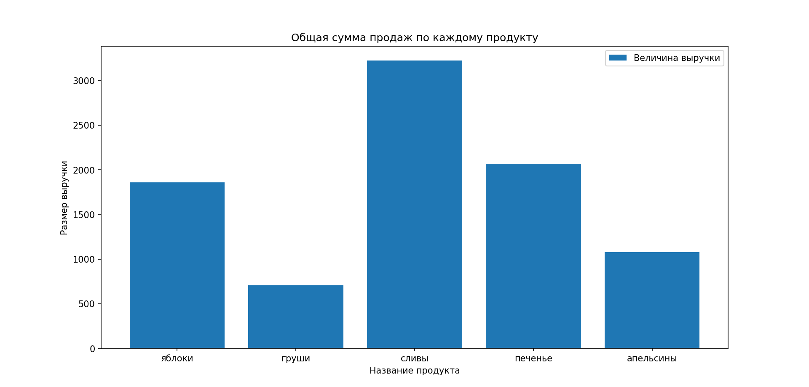
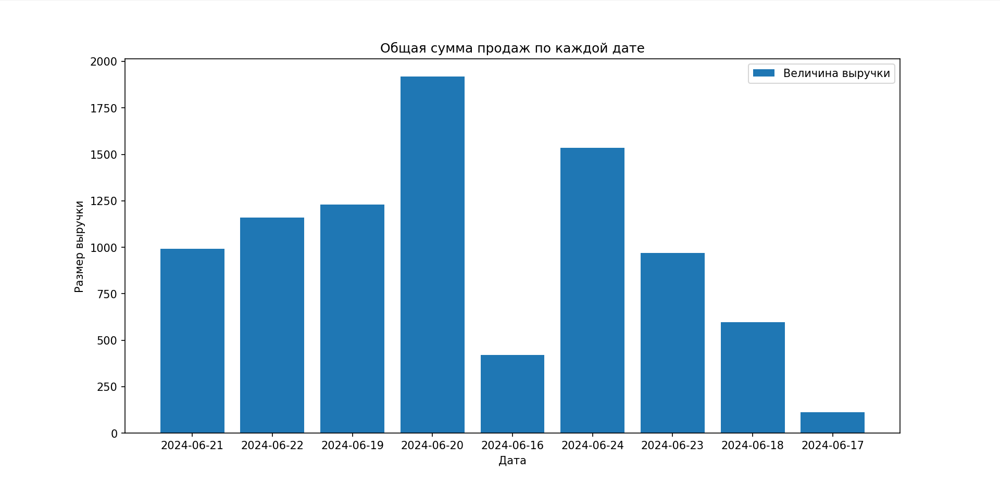

# Анализ данных о продажах продуктов в магазине
---
## Основные компоненты
---
- **code.py** - основной скрипт, обрабатывающие входные данные и выдающий результат вместе с графиками
- **data.txt** - текстовый файл с входными данными
- **pics/** - папка содержащая графики и результат работы программы

### Файл code.py
---
1. **read_sales_data(file_path)** - функция, которая принимает путь к файлу и возвращает список продаж. Продажи в свою очередь являются словарями с ключами `product_name`, `quantity`, `price`, `date` (название, количество, цена, дата).
2. **total_sales_per_product(sales_data)** - функция, которая принимает список продаж и возвращает словарь, где ключ - название продукта, а значение - общая сумма продаж этого продукта.
3. **sales_over_time(sales_data)** - функция, которая принимает список продаж и возвращает словарь, где ключ - дата, а значение общая сумма продаж за эту дату.

## Результат работы программы

## График продаж по каждому товару

## График продаж по каждой дате

